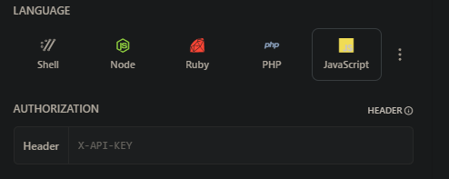

## Brief Description of Application

_The application, built with React and Ant Design, allows users to track their purchased crypto assets, including price and profit. It utilizes a JSON server to store user assets, while fetching real-time data from [coinstats.app](https://coinstats.app/) ._

## API configuration
1) Register here [Coinstats API](https://openapi.coinstats.app/login/)
2) Generate API key and copy it 
3) Move to documentation [Coinstats Docs](https://coinstatsopenapi.readme.io/reference/coincontroller_coinlist)
4) Paste generated API key and fetch data 
5) Application ready to be used
