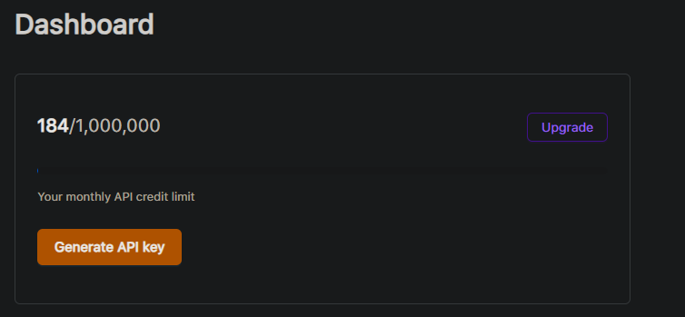
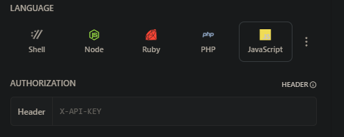

## Brief Description of Application

_This MERN (Mongo Atlas, Express, React, Node.js) project enables users to track their purchased crypto assets, including their prices and profits. Authenticated users have the ability to add, delete, and modify their crypto assets._

### Backend:
_The backend is implemented using Node.js and [Express](https://expressjs.com/). It connects to [Mongo Atlas](https://www.mongodb.com/atlas/database) for storing data._

### Frontend:
_The frontend is implemented using [React](https://react.dev/) and [Ant Design](https://ant.design/). Real-time data about cryptocurrencies is fetched from [coinstats.app](https://coinstats.app/). Users can perform CRUD operations on their crypto assets._

### Authentication:
_Registration and login functionalities are implemented using [Supabase](https://supabase.com/docs/guides/auth/quickstarts/react). Users also have the ability to change their passwords._


| <span style="color: green; font-size: 20px;">TIP: If you simply want to familiarize yourself and test the functionality of the application, please use this link:<br/>[Vercel Deployment](https://mern-crypto-app-frontend.vercel.app/) |
|-----------------------------------------------------------------------------------------------------------------------------------------------------------------------------------------------------------------------------------------|

## Backend configuration
1) Create ```.env``` file
2) Inside ```.env``` create environmental variable ```DATABASE_URI=YOUR URI```
3) For ```DATABASE_URI``` please follow [Mongo DB docs](https://www.mongodb.com/docs/drivers/node/current/quick-start/)
4) Your ```DATABASE_URI``` appears in ```server.js``` file ```const URI = process.env.DATABASE_URI;```
5) To run backend part use ```nodemon app``` in console

## Frontend configuration

### API configuration ([coinstats.app](https://coinstats.app/))
1) Register here [Coinstats API](https://openapi.coinstats.app/login/)
2) Generate API key and copy it<br>

3) Move to documentation [Coinstats Docs](https://coinstatsopenapi.readme.io/reference/coincontroller_coinlist)
4) Paste generated API key and fetch data<br>

5) Create ```.env``` file in root directory and past your key ```VITE_API_KEY=YOUR_KEY_HERE```


### Supabase Auth configuration
1) You can follow official [Supabase Auth docs](https://supabase.com/docs/guides/auth/quickstarts/react)
2) Create new project in Supabase dashboard
3) Inside your new project (Supabase dashboard) check for ```SUPABASE_URL``` and ```ANON_KEY```
4) Create ```.env``` file and specify ```VITE_APP_SUPABASE_URL=YOUR URL```, ```VITE_APP_ANON_KEY=YOUR KEY```


#### If you want to test application, please change endpoints in ```api.ts``` file. For example:

```
export async function fetchAssets(): Promise<CryptoAsset[]> {
  try {
    const response = await axios.get('http://localhost:8080/');
    return response.data;
  } catch (err) {
    console.error(err);
    throw err;
  }
}
```
To run frontend part use ```npm run dev``` in console.

